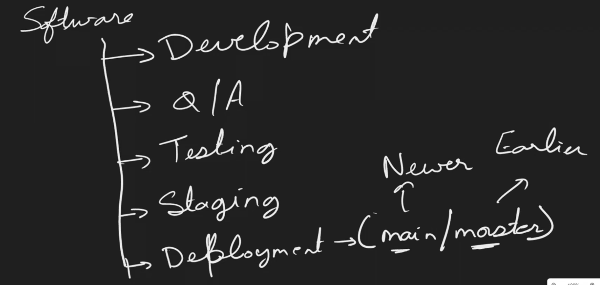
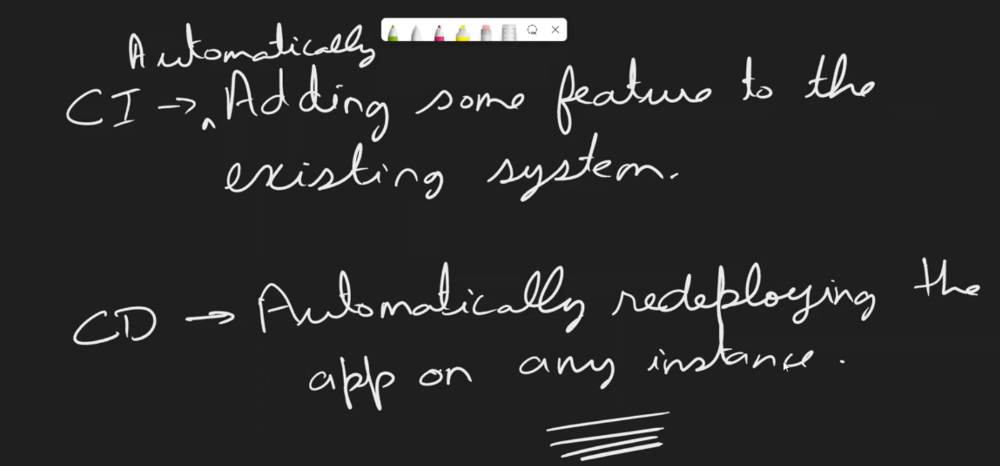

# **Git**
- it is a service that is used for version control .
# **Github**
- it is like a service provider that provides the service of version control .
## **Features of Git**
- Open Source : free to use and code is available online .
- Scalable : it can be shrunk or scaled as per the requirement .
- Distributed : 
- Speed :
- Security :
- Branching and Merging

* stash command is used to roll back to a previous version .

### **Commands**
1. cd d: => to change directory to d .
2. ls => list down all the directories .
3. mkdir Git => this will create a directory with the name Git .
4. clear => helps in cleaning the terminal .
5. touch => to create a file .
6. git init => used to initialize empty git repository .
7. git status =>
8. git add . => this means we have to add everything to the staging area , instead of " . " we can also name a particular file .
9. git push origin main => to push our code 
10. git pull origin main => to pull our code from GitHub to local .
11. git add . && git commit -m "third commit"
12. git clone url ==> to clone a repo just paste its https address instead of url .
13. git branch => used to list down all the present branches .
14. git checkout -b Dev
15. git log
16. git checkout Dev
17. git stash => used when we need to do checkout to some other branch, and we have some uncommited changes then either we can commit them and checkout or we can stash means remove or cut those changes and checkout .
18. git stash pop
19. 

**common error**
- merge conflict : When we have changes in the same file and at same line in both the local repo and repo on GitHub .
-  